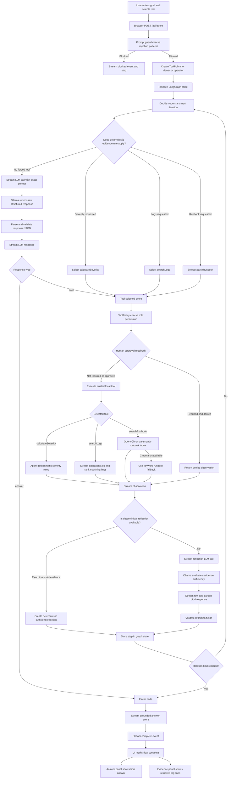

# Airbus Intelligence Hub Architecture

## Purpose

Airbus Intelligence Hub is a local operations agent. The React web application is the only
user interface. It communicates with a local Node API that executes the real
guarded LangGraph workflow and streams every decision back to the browser.

## Components

```text
React web console :3000
        │
        │ HTTP + Server-Sent Events
        ▼
Airbus Intelligence Hub Node API :8787
        │
        ├── Prompt guard
        ├── LangGraph workflow
        ├── Tool authorization policy
        ├── Local operational tools
        └── Resource ingestion
             │
             ├── Ollama :11434
             ├── ChromaDB health check :8000
             ├── data/runbooks/*.md
             └── data/logs/operations.log
```

## Source layout

- `web/app/airbus-intelligence-hub-console.tsx`: browser interface and SSE consumer.
- `web/app/globals.css`: console visual design.
- `src/server.ts`: local REST and streaming API.
- `src/langgraph/workflow.ts`: graph state, nodes, and routing.
- `src/agent/react-agent.ts`: LLM decisions, reflection, and tool execution.
- `src/guardrails/prompt-guard.ts`: prompt-injection checks.
- `src/guardrails/tool-policy.ts`: role permissions and tool authorization.
- `src/tools/operations.ts`: logs, runbooks, memory, severity, and mock actions.
- `src/tools/contracts.ts`: tool interfaces and input validation.

## Agent request

The browser sends:

```http
POST http://127.0.0.1:8787/api/agent
Content-Type: application/json

{
  "goal": "Using local logs only, did latency exceed 2 seconds?",
  "role": "operator"
}
```

The role is selected in the web prompt header:

- `viewer`: read-only evidence tools.
- `operator`: read-only tools plus severity and approved mock-action tools.

Changing the selector changes the `role` sent with the next API request; it is
not merely a visual label.

The API keeps the connection open and sends Server-Sent Events.

```text
1. prompt-guard
2. prompt
3. decision or llm-call
4. tool selected
5. tool guardrail
6. tool observation
7. llm-call for reflection
8. reflection
9. llm-call for the next decision
10. grounded answer
11. complete
```

The UI adds each real event to the decision flow. The latest event is red while
work is in progress. When a new event arrives, the previous event becomes
complete.

Each model-dependent step also streams the exact local Ollama request payload:

- Model name.
- Temperature.
- System message constructed by Airbus Intelligence Hub.
- User message containing the goal and current observations.
- Current graph iteration.

Selecting an **LLM call** step opens this payload in the right-side inspector.
After Ollama returns, Airbus Intelligence Hub emits a separate **LLM response** step containing
both the raw model text and the parsed JSON object used by the workflow.

## Decision logic

The graph starts at `decide`.

```text
START
  → decide
      ├── answer → finish → END
      └── tool
           → authorize and execute
           → reflect
           → decide again
```

Deterministic controller rules force evidence retrieval for requests that
explicitly require logs, runbooks, severity calculations, or mock actions.
Otherwise, Ollama chooses whether to call a tool or answer.

## Detailed complex request flow

The following diagram shows the most complete path: a user asks for severity,
log evidence, documented runbook guidance, and a final grounded answer.



### Example iteration sequence

For a question requiring severity, logs, and a runbook, the intended sequence
is:

```text
Iteration 1
  → deterministic controller selects calculateSeverity
  → policy authorizes it
  → deterministic tool returns SEV result
  → reflection checks whether more evidence is required

Iteration 2
  → controller sees logs are requested but not yet retrieved
  → selects searchLogs
  → exact log lines are returned
  → reflection checks whether documented guidance is still missing

Iteration 3
  → controller sees runbook guidance is requested but not yet retrieved
  → selects searchRunbook
  → ChromaDB returns semantic runbook chunks
  → reflection evaluates whether all requested evidence is available

Iteration 4
  → no required evidence tool remains
  → Airbus Intelligence Hub sends the goal and complete transcript to Ollama
  → Ollama returns an answer decision
  → LangGraph finishes and streams the grounded answer
```

The exact displayed step number can differ because every prompt, response,
guardrail, observation, and reflection is represented as its own visual step.

## Current retrieval design

The application uses two retrieval strategies:

- Runbooks use Ollama embeddings and ChromaDB semantic similarity.
- Logs use deterministic term matching over structured text.

```text
runbook
  → paragraph-aware chunks
  → content hash
  → embed only new or changed chunks with nomic-embed-text
  → store vectors in airbus-intelligence-hub-runbooks ChromaDB collection

runbook question
  → Ollama query embedding
  → ChromaDB cosine similarity
  → strongest semantic chunks

log question
  → stream operations.log line-by-line
  → normalize terms and remove stop words
  → score matching lines
  → return strongest exact matches
```

If Ollama embeddings or ChromaDB are unavailable, runbook retrieval falls back
to keyword scoring instead of failing the whole agent request.

## LLM calls

The API emits an explicit `llm-call` event before model-dependent graph work.
The UI therefore shows when Airbus Intelligence Hub is waiting for Ollama rather than making
the delay look like tool or application work.

Ollama is used for:

- Selecting the next action when deterministic routing does not decide it.
- Evaluating evidence sufficiency when no deterministic reflection applies.
- Producing the final grounded answer.

## Guardrails

The prompt guard runs before LangGraph. A blocked prompt never reaches Ollama.

The tool policy runs before every tool:

- `viewer` can use read-only search tools.
- `operator` can also use severity and mock action tools.
- Duplicate identical tool calls are blocked.
- Mock side effects require approval and are denied by the unattended web API.

## Evidence

`searchLogs` reads:

`data/logs/operations.log`

Its returned log lines are streamed in the `observation` event. The UI extracts
those exact lines and displays them under **Evidence used**.

Runbook tools read:

`data/runbooks/*.md`

## Resource requests

### List resources

```text
GET /api/resources
  → read Markdown runbooks
  → read operation-log lines
  → return one JSON list
```

### Add a log

```text
POST /api/resources kind=log
  → validate input
  → append to data/logs/operations.log
  → immediately becomes searchable by searchLogs
```

No embedding update is required. `searchLogs` reads the current file during
every tool call, so a newly appended line is available immediately.

Log files can also be streamed directly to:

```text
POST /api/log-files
  → stream request bytes directly to operations.log
  → do not place the complete upload in JSON or application memory
  → immediately becomes searchable by searchLogs
```

### Add knowledge

```text
POST /api/resources kind=knowledge
  → validate input
  → create a safe Markdown filename
  → write to data/runbooks
  → immediately becomes searchable by runbook tools
```

The API synchronizes the runbook vector index after a knowledge file is added.
Only chunks with new content hashes are embedded. Unchanged chunks are reused.

### Update a runbook

The knowledge list provides an edit action:

```text
Edit runbook
  → PUT /api/runbooks
  → validate the existing Markdown source
  → replace the local file
  → remove vectors for the old source
  → chunk the updated file
  → embed changed chunks
  → refresh the Chroma collection
```

If ChromaDB is offline, the runbook file is still saved. The UI continues using
keyword fallback. The next successful index synchronization removes stale
vector IDs and embeds the updated chunks.

The browser does not use SQLite, MySQL, D1, or browser storage as the source of
truth. Operational data remains in local files.

## When embeddings are updated

The runbook ingestion flow is:

```text
new or changed log/runbook
  → split only that content into chunks
  → generate embeddings for those chunks
  → upsert those vectors into ChromaDB
  → remove obsolete vectors when content is deleted or replaced
```

Existing unchanged vectors can remain in ChromaDB. A complete re-index is only
needed when:

- The embedding model changes.
- The chunking strategy changes.
- Stored vector metadata or collection structure changes.
- The vector collection becomes inconsistent or corrupted.

For high-volume live logs, embedding every line synchronously would be
expensive and noisy. A production design would usually batch recent logs,
filter unimportant entries, embed useful windows or incident summaries, and
keep exact keyword/time-range search alongside semantic search.

## Large-log behavior

The upload endpoint and resource listing are memory-safe:

- Uploads stream directly to disk.
- The resource screen reads only the latest log window.
- Agent log search streams the file line-by-line rather than using `readFile`.

However, scanning a multi-GB file for every question remains an O(file size)
operation and will become slow. This design avoids memory exhaustion but is not
a production log analytics engine.

For sustained GB-scale logs, use Loki, OpenSearch, Elasticsearch, or ClickHouse
for timestamp indexes, service filters, retention, and fast aggregation. Keep
Airbus Intelligence Hub's log tool as an adapter to that system. Embeddings should be reserved
for selected incident windows, unusual events, or summaries rather than every
raw log line.

## Health request

```text
GET /api/health
  → confirm API is running
  → check Ollama /api/tags
  → check ChromaDB /api/v2/heartbeat
  → return readiness and latency
```

The UI refreshes health every five seconds. Status indicators are based on real
requests, not hard-coded values.

## Answer panel

The inspector displays:

- **Answer**: the latest real `answer` event.
- **Evidence used**: relevant log lines returned by tools.
- **Safety**: current authorization and prompt status.

## Local-only operation

No hosted database or hosted site is required. Run:

```bash
npm run api
```

and, in `web`:

```bash
npm run dev
```

Then use `http://localhost:3000`.
